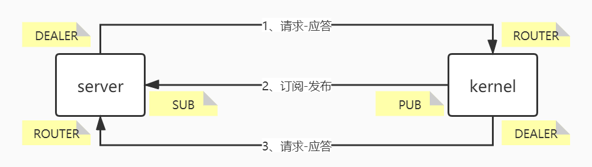

# python-web-ide-kernel

#### 介绍
Python 交互式解释器，对CPython进行封装。


#### 安装教程

   ```bash
python index.py
   ```

#### 网络协议



###### 消息头

| 属性     | 类型   | 描述   |
| -------- | ------ | ------ |
| msg_id   | number | 消息ID |
| username | string | 用户名 |
| session  | string | 会话ID |

###### 请求-应答

1. 端口与连接

   > tcp://127.0.0.1:5555

2. 请求

   | 属性          | 类型   | 描述                                                  |
   | ------------- | ------ | ----------------------------------------------------- |
   | content       | object | 消息体                                                |
   | heander       | object | 消息头                                                |
   | msg_type      | string | 消息类型：execute_request 计算、complete_request 补全 |
   | parent_header | object | 父消息头                                              |

   - 计算

     ```javascript
     {
      'content': {'code': ''},
      'header': {'msg_id': 0, 'username': '', 'session': ''},
      'msg_type': 'execute_request',
      'parent_header': {}
     }
     ```

   - 补全

     ```javascript
     {
      'content': {'text': ''},
      'header': {'msg_id': 0, 'username': '', 'session': ''},
      'msg_type': 'complete_request',
      'parent_header': {}
     }
     ```

3. 应答

   | 属性          | 类型   | 描述                                              |
   | ------------- | ------ | ------------------------------------------------- |
   | content       | object | 消息体                                            |
   | header        | object | 消息头                                            |
   | msg_type      | string | 消息类型：execute_reply 计算、complete_reply 补全 |
   | parent_header | object | 父消息头                                          |

   - 计算

     - 成功

       ```javascript
       {
        'content': {'status': 'ok'},
        'header': {'msg_id': 0, 'username': '', 'session': ''},
        'msg_type': 'execute_reply',
        'parent_header': {'msg_id': 0, 'username': '', 'session': ''}
       }
       ```

     - 报错

       ```javascript
       {
        'content': {'status': 'error', 'traceback': [], 'etype': "", 'evalue': ""},
        'header': {'msg_id': 6, 'username': '', 'session': ''},
        'msg_type': 'execute_reply',
        'parent_header': {'msg_id': 2, 'username': '', 'session': ''}
       }
       ```

     - 中止

       ```javascript
       {
        'content': {'status': 'aborted'},
        'header': {'msg_id': 0, 'username': '', 'session': ''},
        'msg_type': 'execute_reply',
        'parent_header': {'msg_id': 0, 'username': '', 'session': ''}
       }
       ```

   - 补全

     - 成功

       ```javascript
       {
        'content': {'status': 'ok', 'matches': []},
        'header': {'msg_id': 0, 'username': '', 'session': ''},
        'msg_type': 'complete_reply',
        'parent_header': {'msg_id': 0, 'username': '', 'session': ''}
       }
       ```

     - 中止

       ```javascript
       {
        'content': {'status': 'aborted'},
        'header': {'msg_id': 0, 'username': '', 'session': ''},
        'msg_type': 'complete_reply',
        'parent_header': {'msg_id': 0, 'username': '', 'session': ''}
       }
       ```

###### 订阅-发布

1. 端口与连接

   > tcp://127.0.0.1:5556

2. 发布

   | 属性          | 类型   | 描述                                                   |
   | ------------- | ------ | ------------------------------------------------------ |
   | content       | object | 消息体                                                 |
   | header        | object | 消息头                                                 |
   | msg_type      | string | 消息类型：pyin 输入、pyout 输出、pyerr 报错、stream 流 |
   | parent_header | object | 父消息头                                               |

   - 输入

     ```javascript
     {
      'content': {'code': ''},
      'header': {'msg_id': 0, 'username': '', 'session': ''},
      'msg_type': 'pyin',
      'parent_header': {'msg_id': 0, 'username': '', 'session': ''}
     }
     ```

   - 输出

     - 文本

       ```javascript
       {
        'content': {'data': {'category': 'text', 'content': ''}},
        'header': {'msg_id': 0, 'username': '', 'session': ''},
        'msg_type': 'pyout',
        'parent_header': {'msg_id': 0, 'username': '', 'session': ''}
       }
       ```

     - html

       ```javascript
       {
        'content': {'data': {'category': 'html', 'content': ''}},
        'header': {'msg_id': 0, 'username': '', 'session': ''},
        'msg_type': 'pyout',
        'parent_header': {'msg_id': 0, 'username': '', 'session': ''}
       }
       ```

     - markdown

       ```javascript
       {
        'content': {'data': {'category': 'markdown', 'content': ''}},
        'header': {'msg_id': 0, 'username': '', 'session': ''},
        'msg_type': 'pyout',
        'parent_header': {'msg_id': 0, 'username': '', 'session': ''}
       }
       ```

     - 图片

       ```javascript
       {
        'content': {'data': {'category': 'image', 'content': ''}},
        'header': {'msg_id': 0, 'username': '', 'session': ''},
        'msg_type': 'pyout',
        'parent_header': {'msg_id': 0, 'username': '', 'session': ''}
       }
       ```

   - 报错

     ```javascript
     {
      'content': {'status': 'error', 'traceback': [], 'etype': "", 'evalue': ""},
      'header': {'msg_id': 0, 'username': '', 'session': ''},
      'msg_type': 'pyerr',
      'parent_header': {'msg_id': 0, 'username': 'username', 'session': ''}
     }
     ```

   - 流

     ```javascript
     {
      'content': {'name': '', 'data': ''},
      'header': {'msg_id': 0, 'username': '', 'session': ''},
      'msg_type': 'stream',
      'parent_header': {'msg_id': 0, 'username': '', 'session': ''}
     }
     ```

###### 请求-应答

1. 端口与连接

   > tcp://127.0.0.1:5557

2. 请求

   | 属性          | 类型   | 描述     |
   | ------------- | ------ | -------- |
   | content       | object | 消息体   |
   | header        | object | 消息头   |
   | msg_type      | string | 消息类型 |
   | parent_header | object | 父消息头 |

   ```javascript
   {
    'content': {},
    'header': {'msg_id': 0, 'username': '', 'session': ''},
    'msg_type': 'input_request',
    'parent_header': {'msg_id': 0, 'username': '', 'session': ''}
   }
   ```

3. 应答

   | 属性          | 类型   | 描述     |
   | ------------- | ------ | -------- |
   | content       | object | 消息体   |
   | header        | object | 消息头   |
   | msg_type      | string | 消息类型 |
   | parent_header | object | 父消息头 |

   ```javascript
   {
    'content': {'data': ''}, 
    'header': {'msg_id': 0, 'username': '', 'session': ''},
    'msg_type': 'input_reply', 
    'parent_header': {'msg_id': 0, 'username': '', 'session': ''}, 
   }
   ```